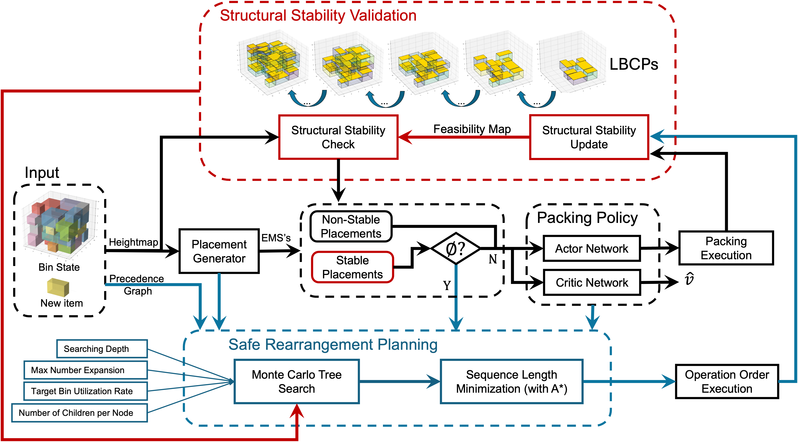
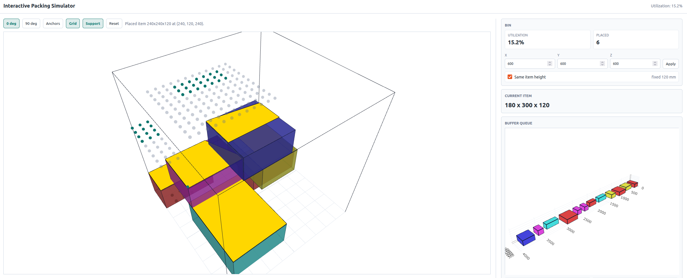

# Online 3D Bin Packing With Stability Validation And Repacking Planning

Research code and demonstrations for online 3D bin packing with fast
structural stability validation, learned packing policy, and safe
repacking planning.

The project focuses on practical palletizing behavior: items are packed with
their true physical dimensions, optional clearance can be reserved around each
item for robot execution, and unstable placements are filtered before they are
accepted.

## What This Repository Demonstrates

- Structural stability validation using a height map and feasibility map.
- Actor-critic packing policy over EMS-based placement candidates.
- MCTS-based safe repacking planning when the incoming item is blocked.
- Interactive Plotly/Three.js tools for inspecting packing, support regions,
  buffer items, and replayed execution sequences.
- Reproducible train/test/demo entry points with notebooks and Docker support.

## Project Roadmap

This repository can be read as a staged research pipeline for practical online
3D bin packing: validate stable placements, choose packing actions, recover
from blocked states with repacking, and inspect each stage through replayable
visual artifacts.

### System Overview



- The system starts from online item arrivals and a fixed pallet/container.
- Candidate placements are generated from EMS-based free-space geometry.
- Each candidate is checked against geometric feasibility and structural
  stability before it can be accepted.
- A learned packing policy selects among stability-validated candidates.
- When direct packing fails, MCTS searches safe unpack, repack, and pack
  sequences.
- Plotly/Three.js visualizations and real-platform demos expose the behavior of
  each module.

### Interactive Stability Simulator


- The simulator provides a hands-on interface for testing placement candidates
  before running a full policy or MCTS sequence.
- Its backend uses the same height-map and feasibility-map stability validation
  logic used by the packing system.
- Grid and anchor previews make stable placements visually inspectable, while
  rejected placements expose where feasibility or support constraints fail.
- The static simulator preview is also available at
  `examples/figures/interactive_simulator.png`.

### Stability-Ensured Packing Policy

- The actor-critic policy ranks EMS-based placement candidates after invalid or
  unstable actions have been filtered out.
- The policy therefore optimizes utilization while inheriting the same
  stability constraints used by the simulator and environment.
- Open the hosted replay:
  [stability-ensured packing policy](https://ziyan-gao.github.io/online-3d-bin-packing-stability-repacking/replays/packing_steps.html).
- The same replay is also included locally at
  `outputs/plotly_live/notebook_demo/packing_steps.html`.

### MCTS And Safe Repacking

- MCTS is triggered when the incoming item cannot be packed directly by the
  policy placement process.
- The planner searches over unpack, repack, and final pack operations on the
  current container state.
- Each searched operation is replayed through the same environment constraints,
  so repacking proposals must remain geometrically feasible and stable.
- Open the hosted replay:
  [raw MCTS repacking](https://ziyan-gao.github.io/online-3d-bin-packing-stability-repacking/replays/mcts_replay.html).
- The same replay is also included locally at
  `outputs/plotly_live/notebook_demo/mcts_replay.html`.

### Optimized Repacking Sequence

- The raw MCTS result is converted into a shorter executable operation sequence
  for the final unpack, repack, and pack procedure.
- Open the hosted replay:
  [optimized repacking sequence](https://ziyan-gao.github.io/online-3d-bin-packing-stability-repacking/replays/mcts_optimized_replay.html).
- The same replay is also included locally at
  `outputs/plotly_live/notebook_demo/mcts_optimized_replay.html`.
- Real-platform demonstrations show the stability validation and policy-driven
  repacking behavior on hardware:
  `examples/figures/random_stable_loading_acc.gif` and
  `examples/figures/policy_rearrangement_demo.gif`.

## Real-Platform Demonstrations

**Random stable loading validation**


Three random stable loading sequences on the real platform, used to support the
proposed structural stability validation method.

**Policy packing with safe repacking**


Robot palletizing procedure showing packing, unpacking, and repacking on the
pallet using the trained policy and repacking planner.

The GIFs are stored in `examples/figures/` so the demonstrations render directly in the
README.

## Installation

Create the recommended conda environment:

```bash
conda env create -f environment.yml
conda activate packing-toolkit
poetry config virtualenvs.create false --local
poetry install --no-dev --no-root
python -m ipykernel install --user --name packing-toolkit --display-name "Python (packing-toolkit)"
```

The environment pins `sqlite` and `libsqlite` from `conda-forge` to the same
version. This avoids Jupyter kernel startup failures such as:

```text
undefined symbol: sqlite3_deserialize
```

Tianshou is installed by Poetry rather than directly by conda. The project pins
the source revision in `pyproject.toml` because that dependency is more fragile
than the regular Python packages.

## Try It Quickly

Open the proposed-framework notebook walkthrough:

```bash
jupyter lab examples/tutorials/packing_demo.ipynb
```

Run the clearance tutorial, which shows how `buffer_space` changes virtual
occupied dimensions used for feasibility and collision checks:

```bash
jupyter lab examples/tutorials/clearance_demo.ipynb
```

Start the manual interactive simulator:

```bash
python -m interactive_simulator_app
```

Then open:

```text
http://127.0.0.1:8765
```

Run a deterministic validation/MCTS run:

```bash
python test.py --config configs/test_default.yaml
```

Run training:

```bash
python train.py --config configs/train_default.yaml
```

## Main Components

- `packing_env/`: Gymnasium environment, EMS generation, height/feasibility
  maps, stability validation, core data types, and environment visualization.
- `packing/`: checkpoint-backed policy agent, policy loading, MCTS
  rearrangement search, execution-plan optimization, and replay utilities.
- `train.py` and `test.py`: script entry points for training and validation.
- `examples/tutorials/`: notebook walkthroughs and simulator notes.
- `examples/figures/`: README and tutorial images/GIFs.
- `outputs/`: checkpoints, generated replays, and live visualization artifacts.
- `integrations/`: external simulator integrations, currently CoppeliaSim.
- `interactive_simulator_app/`: browser-based manual packing simulator.
- `configs/`: default train/test configuration files.
- `docker/`: containerized workflows, including Compose services, the image
  definition, Docker-specific requirements, and GPU setup helper.

## Validation And Testing

Default train/test settings live in `configs/train_default.yaml` and
`configs/test_default.yaml`.

Run the validation sequence:

```bash
python test.py --config configs/test_default.yaml
```

Run with a policy checkpoint:

```bash
python test.py \
  --checkpoint outputs/train_outputs/random/policy_step.pth \
  --container-size 600 600 600 \
  --buffer-space 10
```

Enable live visualization:

```bash
python test.py \
  --checkpoint outputs/train_outputs/random/policy_step.pth \
  --container-size 600 600 600 \
  --buffer-space 10 \
  --visualize
```

The live visualization URL is printed by the script. Interactive replay files
are written under `outputs/plotly_live/` when `--save-replay` is enabled.

## Training

This public release includes a pretrained demo checkpoint under
`outputs/train_outputs/random/`. The default policy examples use
`outputs/train_outputs/random/policy_step.pth` when available.

Run the default training configuration:

```bash
python train.py --config configs/train_default.yaml
```

Training outputs are written under `outputs/train_outputs/` by default.

## Buffered Packing Clearance

Use `--buffer-space` to reserve extra x/y space for each packed item. The unit is
millimeters, the same as item dimensions and container size.

For an item with true dimension `(dx, dy, dz)` and buffer space `b`:

```text
Virtual_Dim = (dx + b, dy + b, dz)
```

The real and virtual boxes share the same FLB anchor. The virtual dimension is
used for EMS feasibility and container collision checks. The true item dimension
is used for height-map updates, stability validation, utilization, and physical
support reasoning.

`--buffer-space` must be divisible by the map resolution, currently `10 mm`.

## Visualization And Tutorials



- `examples/tutorials/packing_demo.ipynb`: proposed-framework walkthrough with policy
  packing, MCTS rearrangement, optimized operation sequence, and interactive
  replays.
- `examples/tutorials/clearance_demo.ipynb`: focused walkthrough of `buffer_space`, true
  dimensions, virtual dimensions, and replayed packing sequences.
- `examples/tutorials/interactive_simulator_demo.ipynb`: launches the manual simulator
  in Jupyter and explains grid candidates plus stability validation.
- `python -m interactive_simulator_app`: starts the standalone browser
  simulator.

The environment visualizer shows the packed container, support polygons,
candidate anchor points, buffer items, and staging/holding areas. The manual
simulator uses a Three.js main container view with a Plotly buffer panel.

## Common CLI Options

```text
--checkpoint PATH              Policy checkpoint.
--ds-name NAME                 Dataset or built-in item distribution.
--container-size DX DY DZ      Container dimensions in millimeters.
--buffer-space B               Extra x/y clearance in millimeters.
--iterations N                 MCTS iteration budget.
--max-unpack N                 Maximum number of unpack actions in search.
--target-util R                Target utilization ratio.
--visualize                    Start live Plotly visualization.
--save-replay                  Save an interactive HTML replay.
--optimize-sequence            Optimize unpack/repack execution order.
```

For the full list:

```bash
python test.py --help
python train.py --help
```

## Docker

Build the image:

```bash
docker compose -f docker/docker-compose.yml build
```

Start a CPU shell:

```bash
docker compose -f docker/docker-compose.yml run --rm shell
```

Run validation:

```bash
docker compose -f docker/docker-compose.yml run --rm test
```

Generate a demo replay:

```bash
docker compose -f docker/docker-compose.yml run --rm demo
```

Serve generated replay files:

```bash
docker compose -f docker/docker-compose.yml up replay
```

Then open replay HTML files under `http://127.0.0.1:8090/`.

Start the tutorial notebook:

```bash
docker compose -f docker/docker-compose.yml up notebook
```

Run GPU training:

```bash
docker compose -f docker/docker-compose.yml --profile gpu up train-gpu
```

More Docker notes are in `docker/README.md`.

## License

This project is licensed under the MIT License. See [LICENSE](LICENSE) for
details.

## Development Notes

This project uses Python 3.11. The local environment is created with
`environment.yml`, then Poetry reads `pyproject.toml` to install the pinned
Tianshou dependency. The Docker image installs the runtime dependencies from
`docker/requirements_docker.txt`.

Before committing changes, a lightweight syntax check is:

```bash
python -m compileall packing_env packing test.py train.py
```
